# Лабораторная работа №2 
1. Развернуть базу данных: ```psql.exe -U postgres dump_db < "C:\Users\IDKWHATIMDOINGHERE\Downloads\demo-small-20170815.sql"```
2. Напишите запрос, который просчитает количество билетов в таблице tickets: ```select count(*) from tickets;``` (ответ: 366733)
3. Напишите запрос, который посчитает количество билетов в таблице tickets, купленное на имя 'DENIS': ```select count(passenger_name)  from tickets where passenger_name LIKE 'DENIS%';```
4. Напишите запрос, который вернет имя пассажира и количество билетов этого пассажира, взятые из таблицы tickets, отсортированное по второму столбцу в порядке убывания: 
```
SELECT passenger_name, count(*) FROM tickets
GROUP BY passenger_name
ORDER BY count(*) desc;
```
5. Напишите запрос, который вернет имя пассажира и количество билетов этого пассажира,
взятые из таблицы tickets, отсортированное по второму столбцу в порядке убывания, при
условии, что имена пассажиров = ‘DENIS’: 
```
SELECT passenger_name, count(*) FROM tickets
where passenger_name like 'DENIS%'
GROUP BY passenger_name
ORDER BY count(*) desc;
```
6. Напишите запрос, который из таблицы ticket_flight вернет максимальное и минимальное
значение атрибута amount одновременно (т. е. на выходе вы получите 2 столбца):
```
select max(amount) as max_amout, min(amount) as min_amount from ticket_flights;
```
7. Напишите запрос, который вернет вам атрибуты aircraft_code, model из таблицы aircrafts, а
также атрибуты fare_condition, count (посчитанное количество посадочных мест
определенного класса для определенной модели самолета) из таблицы seats.:
```
select a.aircraft_code, a.model, s.fare_conditions , count(s.seat_no)  from aircrafts a
join seats s on a.aircraft_code = s.aircraft_code
group by a.aircraft_code, a.model, s.fare_conditions ;
```
8. Напишите запрос, который даст ответ на следующий вопрос: в какие города можно улететь
как из Москвы, так и из Санкт-Петербурга?:
```
select arrival_city  from routes r
where departure_city = 'Москва' intersect 
select arrival_city  from routes r2 
where departure_city = 'Санкт-Петербург';
```
9. Напишите запрос, который даст ответ на следующий вопрос: в какие города можно улететь
из Санкт-Петербурга, но нельзя из Москвы?:
```
select arrival_city  from routes r
where departure_city = 'Санкт-Петербург' except 
select arrival_city  from routes r2 
where departure_city = 'Москва';
```

## Часть 2

### 1 База данных:
Схема БД состоит из четырех таблиц:
Product(maker, model, type)
PC(code, model, speed, ram, hd, cd, price)
Laptop(code, model, speed, ram, hd, price, screen)
Printer(code, model, color, type, price)
Таблица Product представляет производителя (maker), номер модели (model) и тип ('PC' - ПК, 'Laptop' - ПК-блокнот или 'Printer' - принтер). Предполагается, что номера моделей в таблице Product уникальны для всех производителей и типов продуктов. В таблице PC для каждого ПК, однозначно определяемого уникальным кодом – code, указаны модель – model (внешний ключ к таблице Product), скорость - speed (процессора в мегагерцах), объем памяти - ram (в мегабайтах), размер диска - hd (в гигабайтах), скорость считывающего устройства - cd (например, '4x') и цена - price (в долларах). Таблица Laptop аналогична таблице РС за исключением того, что вместо скорости CD содержит размер экрана -screen (в дюймах). В таблице Printer для каждой модели принтера указывается, является ли он цветным - color ('y', если цветной), тип принтера - type (лазерный – 'Laser', струйный – 'Jet' или матричный – 'Matrix') и цена - price.

1. Найдите номер модели, скорость и размер жесткого диска для всех ПК стоимостью менее 500 дол. Вывести: model, speed и hd:
```
SELECT model, speed, hd FROM PC
WHERE price < 500
```
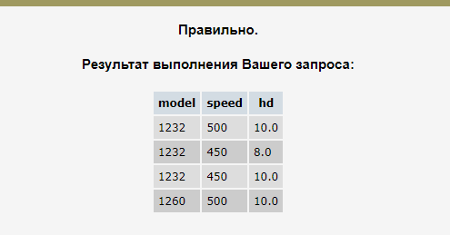 <br>
2. Найдите производителей принтеров. Вывести: maker :
```
SELECT DISTINCT maker FROM Product
WHERE type = 'Printer'
```
 <br>
3. Найдите номер модели, объем памяти и размеры экранов ПК-блокнотов, цена которых превышает 1000 дол. :
```
SELECT model, ram, screen FROM Laptop
WHERE price > 1000
```
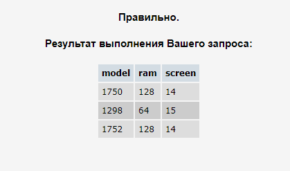 <br>
4. Найдите все записи таблицы Printer для цветных принтеров.:
```
SELECT * FROM Printer
WHERE color = 'y'
```
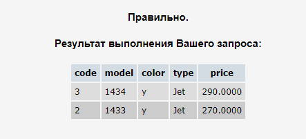 <br>
5. Найдите номер модели, скорость и размер жесткого диска ПК, имеющих 12x или 24x CD и цену менее 600 дол. :
```
SELECT model, speed, hd FROM PC
WHERE (cd = '12x' OR cd = '24x') AND price < 600
```
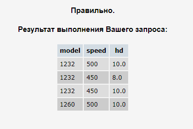 <br>
6. Для каждого производителя, выпускающего ПК-блокноты c объёмом жесткого диска не менее 10 Гбайт, найти скорости таких ПК-блокнотов. Вывод: производитель, скорость.:
```
SELECT DISTINCT maker, speed FROM Product
INNER JOIN Laptop ON Product.model = Laptop.model
WHERE hd >= 10
```
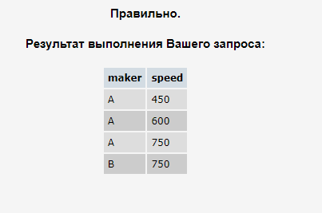 <br>
7. Найдите номера моделей и цены всех имеющихся в продаже продуктов (любого типа) производителя B (латинская буква). :
```
SELECT PC.model, price FROM PC  
INNER JOIN Product ON PC.model = Product.model  
WHERE maker = 'B'  
UNION  
SELECT Laptop.model, price FROM Laptop  
INNER JOIN Product ON Laptop.model = Product.model  
WHERE maker = 'B'  
UNION  
SELECT Printer.model, price FROM Printer  
INNER JOIN Product ON Printer.model = Product.model  
WHERE maker = 'B'
```
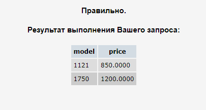 <br>
8. Найдите производителя, выпускающего ПК, но не ПК-блокноты.:
```
SELECT DISTINCT maker FROM Product  
WHERE type = 'PC'  
EXCEPT  
SELECT DISTINCT maker FROM Product  
WHERE type = 'Laptop'  
```
 <br>
9. Найдите производителей ПК с процессором не менее 450 Мгц. Вывести: Maker:
```
SELECT DISTINCT maker FROM Product
INNER JOIN PC ON Product.model = PC.model
WHERE speed >= 450
```
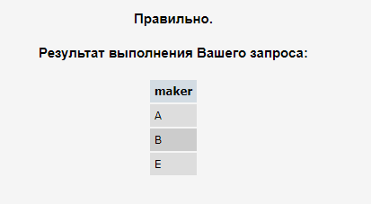 <br>
10. Найдите модели принтеров, имеющих самую высокую цену. Вывести: model, price:
```
SELECT model, price FROM Printer
WHERE price = (SELECT MAX(price) FROM Printer)
```
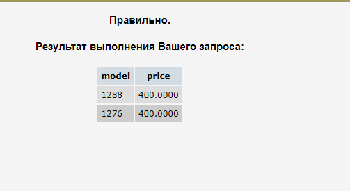 <br>
11. Найдите среднюю скорость ПК. :
```
SELECT AVG(speed) FROM PC
```
 <br>
12. Найдите среднюю скорость ПК-блокнотов, цена которых превышает 1000 дол.:
```
SELECT AVG(speed) FROM Laptop WHERE price > 1000
```
 <br>
13. Найдите среднюю скорость ПК, выпущенных производителем A.:
```
SELECT AVG(speed) FROM PC INNER JOIN Product  
ON PC.model = Product.model  
WHERE maker = 'A'
```
 <br>
### 2-я база данных
Рассматривается БД кораблей, участвовавших во второй мировой войне. Имеются следующие отношения:
Classes (class, type, country, numGuns, bore, displacement)
Ships (name, class, launched)
Battles (name, date)
Outcomes (ship, battle, result)
Корабли в «классах» построены по одному и тому же проекту, и классу присваивается либо имя первого корабля, построенного по данному проекту, либо названию класса дается имя проекта, которое не совпадает ни с одним из кораблей в БД. Корабль, давший название классу, называется головным.
Отношение Classes содержит имя класса, тип (bb для боевого (линейного) корабля или bc для боевого крейсера), страну, в которой построен корабль, число главных орудий, калибр орудий (диаметр ствола орудия в дюймах) и водоизмещение ( вес в тоннах). В отношении Ships записаны название корабля, имя его класса и год спуска на воду. В отношение Battles включены название и дата битвы, в которой участвовали корабли, а в отношении Outcomes – результат участия данного корабля в битве (потоплен-sunk, поврежден - damaged или невредим - OK).
Замечания. 1) В отношение Outcomes могут входить корабли, отсутствующие в отношении Ships. 2) Потопленный корабль в последующих битвах участия не принимает.

14. Найдите класс, имя и страну для кораблей из таблицы Ships, имеющих не менее 10 орудий.:
```
SELECT Ships.class, name, country FROM  
Ships INNER JOIN Classes ON Ships.class = Classes.class  
WHERE numGuns >= 10
```
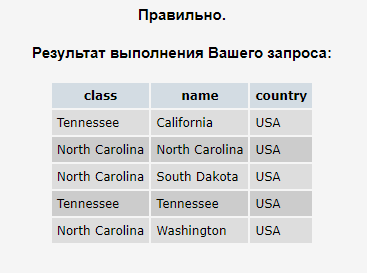 <br>
15. (БД №1) Найдите размеры жестких дисков, совпадающих у двух и более PC. Вывести: HD : 
```
SELECT hd FROM PC 
GROUP BY hd HAVING COUNT(hd) > 1
```
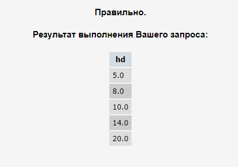 <br>
16. (БД №1) Найдите пары моделей PC, имеющих одинаковые скорость и RAM. В результате каждая пара указывается только один раз, т.е. (i,j), но не (j,i), Порядок вывода: модель с большим номером, модель с меньшим номером, скорость и RAM.:
```
SELECT DISTINCT p1.model, p2.model, p1.speed, p1.ram  
FROM PC p1, PC p2  
WHERE p1.speed = p2.speed  
AND p1.ram = p2.ram  
AND p1.model > p2.model
```
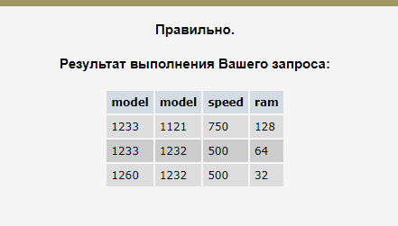 <br>
17. (БД №1) Найдите модели ПК-блокнотов, скорость которых меньше скорости каждого из ПК.
Вывести: type, model, speed :
```
SELECT DISTINCT type, Laptop.model, speed FROM Laptop  
INNER JOIN Product ON Laptop.model = Product.model  
WHERE speed < (SELECT MIN(PC.speed) FROM PC)
```
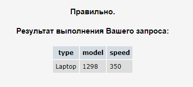 <br>
18. (БД №1) Найдите производителей самых дешевых цветных принтеров. Вывести: maker, price:
```
SELECT DISTINCT maker, price  
FROM Product  
INNER JOIN Printer ON Product.model = Printer.model  
WHERE color = 'y' AND price = (SELECT MIN(price) FROM Printer WHERE color = 'y')
```
 <br>
19. (БД №1) Для каждого производителя, имеющего модели в таблице Laptop, найдите средний размер экрана выпускаемых им ПК-блокнотов.
Вывести: maker, средний размер экрана. : 
```
SELECT maker, AVG(screen) FROM Product  
INNER JOIN Laptop ON Product.model = Laptop.model  
GROUP BY maker  
```
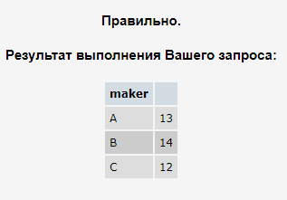 <br>
20. (БД №1) Найдите производителей, выпускающих по меньшей мере три различных модели ПК. Вывести: Maker, число моделей ПК.:
```
SELECT maker, COUNT(model) FROM Product  
WHERE type = 'PC'  
GROUP BY maker  
HAVING COUNT(model) > 2 
```
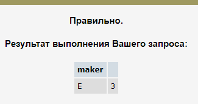 <br>
21. (БД №1) Найдите максимальную цену ПК, выпускаемых каждым производителем, у которого есть модели в таблице PC.
Вывести: maker, максимальная цена.:
```
SELECT maker, MAX(price) FROM Product  
INNER JOIN PC ON Product.model = PC.model  
GROUP BY maker
```
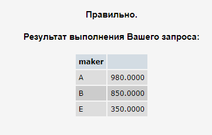 <br>
22. (БД №1) Для каждого значения скорости ПК, превышающего 600 МГц, определите среднюю цену ПК с такой же скоростью. Вывести: speed, средняя цена.:
```
SELECT DISTINCT speed, AVG(price) AS avg_price FROM PC  
WHERE speed > 600 AND speed = speed  
GROUP BY speed
```
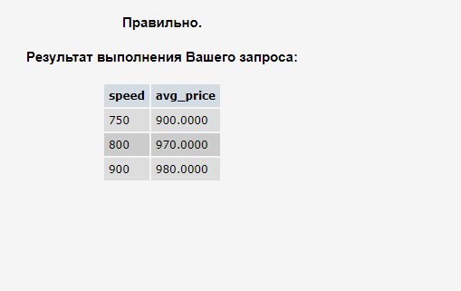 <br>
23. Найдите производителей, которые производили бы как ПК
со скоростью не менее 750 МГц, так и ПК-блокноты со скоростью не менее 750 МГц.
Вывести: Maker :
```
SELECT maker FROM Product  
INNER JOIN PC ON Product.model = PC.model  
WHERE PC.speed >=750  
INTERSECT  
SELECT maker FROM Product  
INNER JOIN Laptop ON Product.model = Laptop.model  
WHERE Laptop.speed >=750
```
 <br>
24. Перечислите номера моделей любых типов, имеющих самую высокую цену по всей имеющейся в базе данных продукции. :
```
WITH maxes AS (  
    SELECT model, MAX(price) AS maxpr  
    FROM PC  
    GROUP BY model  
    HAVING MAX(price) = (SELECT MAX(price) FROM PC)  
    UNION  
    SELECT model, MAX(price) AS maxpr  
    FROM Laptop  
    GROUP BY model  
    HAVING MAX(price) = (SELECT MAX(price) FROM Laptop)  
    UNION  
    SELECT model, MAX(price) AS maxpr  
    FROM Printer  
    GROUP BY model  
    HAVING MAX(price) = (SELECT MAX(price) FROM Printer))  
SELECT model FROM maxes WHERE maxpr = (SELECT MAX(maxpr) FROM maxes)
```
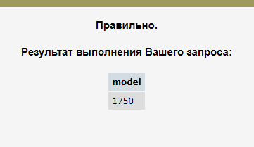 <br>
25. Найдите производителей принтеров, которые производят ПК с наименьшим объемом RAM и с самым быстрым процессором среди всех ПК, имеющих наименьший объем RAM. Вывести: Maker:
```
WITH x AS (  
    SELECT DISTINCT maker, speed FROM Product  
    INNER JOIN PC ON Product.model = PC.model  
    WHERE ram = (SELECT MIN(ram) FROM PC))  
SELECT DISTINCT maker FROM x  
WHERE speed = (SELECT MAX(speed) from x)  
AND maker IN  
    (SELECT maker FROM Product where type = 'printer') 
```
 <br>
26. Найдите среднюю цену ПК и ПК-блокнотов, выпущенных производителем A (латинская буква). Вывести: одна общая средняя цена.:
```
WITH pc_lap_price AS (  
    SELECT code, price, ram, hd FROM PC  
    WHERE model IN (SELECT model FROM Product where maker = 'A')   
    UNION  
    SELECT code, price, ram, hd FROM Laptop  
    WHERE model IN (SELECT model FROM Product where maker = 'A'))  
SELECT AVG(price) FROM pc_lap_price  
```
 <br>
27. Найдите средний размер диска ПК каждого из тех производителей, которые выпускают и принтеры. Вывести: maker, средний размер HD. :
```
SELECT maker, AVG(hd) FROM Product  
INNER JOIN PC ON Product.model = PC.model  
WHERE maker IN (SELECT maker FROM Product WHERE type = 'printer')  
GROUP BY maker  

```
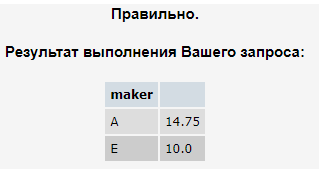 <br>
28. Используя таблицу Product, определить количество производителей, выпускающих по одной модели.:
```
WITH one AS(  
    SELECT COUNT(maker) AS col FROM Product  
    GROUP BY maker HAVING COUNT(maker) = 1)  
SELECT COUNT(col) FROM one  
```
 <br>
### 3 БД
Фирма имеет несколько пунктов приема вторсырья. Каждый пункт получает деньги для их выдачи сдатчикам вторсырья. Сведения о получении денег на пунктах приема записываются в таблицу:
Income_o(point, date, inc)
Первичным ключом является (point, date). При этом в столбец date записывается только дата (без времени), т.е. прием денег (inc) на каждом пункте производится не чаще одного раза в день.

Сведения о выдаче денег сдатчикам вторсырья записываются в таблицу:
Outcome_o(point, date, out)
В этой таблице также первичный ключ (point, date) гарантирует отчетность каждого пункта о выданных деньгах (out) не чаще одного раза в день.

В случае, когда приход и расход денег может фиксироваться несколько раз в день, используется другая схема с таблицами, имеющими первичный ключ code:
Income(code, point, date, inc)
Outcome(code, point, date, out)
Здесь также значения столбца date не содержат времени.

29. В предположении, что приход и расход денег на каждом пункте приема фиксируется не чаще одного раза в день [т.е. первичный ключ (пункт, дата)], написать запрос с выходными данными (пункт, дата, приход, расход). Использовать таблицы Income_o и Outcome_o.:
```
SELECT income_o.point, income_o.date, inc, out
FROM income_o LEFT JOIN outcome_o ON income_o.point = outcome_o.point
AND income_o.date = outcome_o.date
UNION
SELECT outcome_o.point, outcome_o.date, inc, out
FROM income_o RIGHT JOIN outcome_o ON income_o.point = outcome_o.point
AND income_o.date = outcome_o.date
``` 
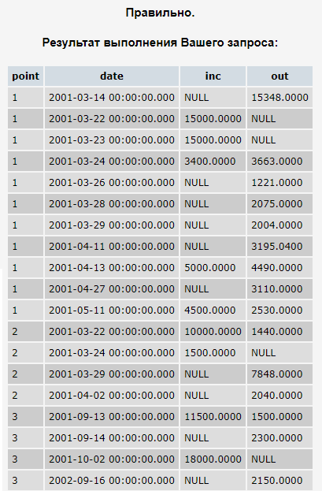 <br>
30. В предположении, что приход и расход денег на каждом пункте приема фиксируется произвольное число раз (первичным ключом в таблицах является столбец code), требуется получить таблицу, в которой каждому пункту за каждую дату выполнения операций будет соответствовать одна строка. Вывод: point, date, суммарный расход пункта за день (out), суммарный приход пункта за день (inc). Отсутствующие значения считать неопределенными (NULL).:
```
WITH a AS(
    SELECT point, date, SUM(inc) AS Income
    FROM income GROUP BY point, date),
    b AS(
    SELECT point, date, SUM(out) AS Outcome
    FROM Outcome GROUP BY point, date)
SELECT a.point, a.date, Outcome, Income
FROM a LEFT JOIN b ON a.point = b.point
AND a.date = b.date
UNION
SELECT b.point, b.date, Outcome, Income
FROM a RIGHT JOIN b ON b.point = a.point
AND b.date = a.date
```
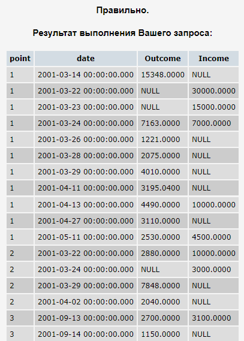 <br>